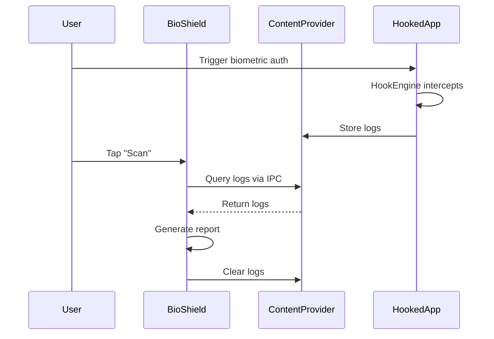
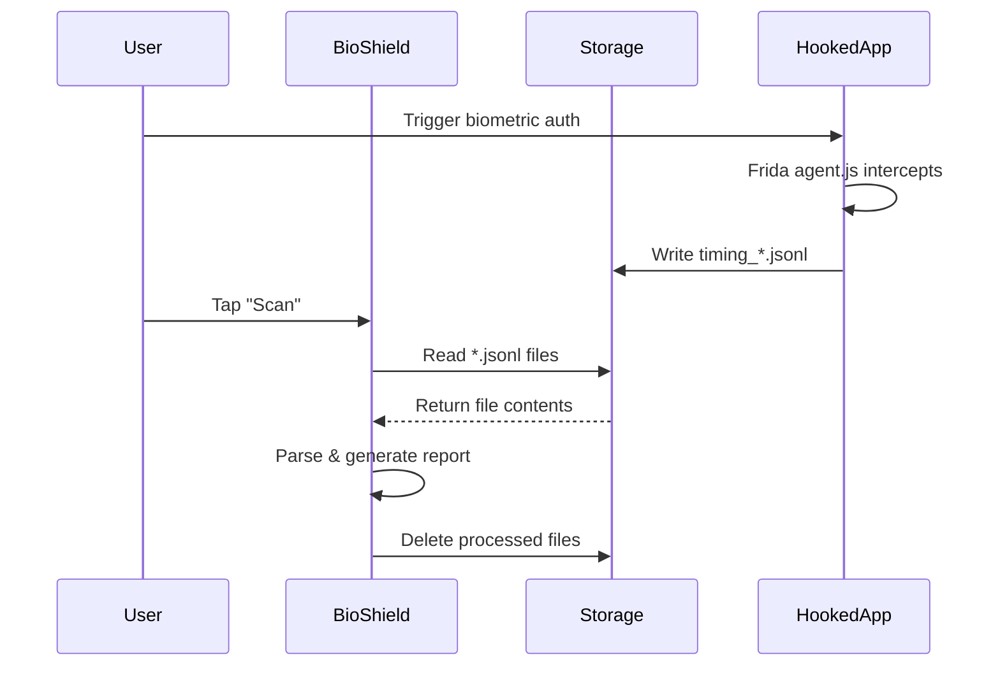

# IPC Simplification Complete ✅

**Date:** November 16, 2025
**Change Type:** Architecture Simplification

---

## What Changed

### Old Architecture (Complex)
```
Vulnerable App (Hooked)
├─ HookEngine.java (injected via repackaging)
├─ TimingTracker.java
├─ HookLogProvider (ContentProvider)
└─ Exposes data via content://authority/data
       ↓ (IPC via ContentProvider)
BioShield App
├─ HookContentProviderService.dart
├─ ContentProviderReader.kt (native bridge)
└─ Reads via MethodChannel IPC
```

### New Architecture (Simple)
```
Any App + Frida Gadget
├─ Frida Gadget injects at startup
├─ agent.js hooks biometric APIs
└─ Writes to /storage/emulated/0/BioShield/logs/*.jsonl
       ↓ (Simple file I/O)
BioShield App
├─ GadgetFileReaderService.dart
└─ Reads JSON files directly
```

---

## Files Modified

### ✅ New Files Created

**1. [lib/services/gadget_file_reader_service.dart](../lib/services/gadget_file_reader_service.dart)**
```dart
class GadgetFileReaderService {
  static const String logDir = "/storage/emulated/0/BioShield/logs";

  Future<List<Map<String, dynamic>>> readAllLogs() async
  Future<int> clearLogs() async
  Stream<FileSystemEvent> watchLogs()
  Future<int> countLogFiles() async
}
```

**Features:**
- ✅ Reads `.jsonl` files from shared storage
- ✅ Parses JSON lines
- ✅ Deletes processed files
- ✅ File system watcher for real-time monitoring
- ✅ Simple, no IPC complexity

---

### ✅ Files Updated

**1. [lib/services/comprehensive_scan_service.dart](../lib/services/comprehensive_scan_service.dart)**

**Before:**
```dart
final _contentProviderService = HookContentProviderService();

Future<ScanResult> performCompleteScan() async {
  final logs = await _contentProviderService.readLogs(packageName);
  final report = await _contentProviderService.generateReport(packageName);
  await _contentProviderService.clearLogs(packageName);
}
```

**After:**
```dart
final _fileReaderService = GadgetFileReaderService();

Future<ScanResult> performCompleteScan() async {
  final logs = await _fileReaderService.readAllLogs();
  final report = _generateReport(logs);
  await _fileReaderService.clearLogs();
}
```

**Changes:**
- ❌ Removed ContentProvider dependency
- ❌ Removed package name requirement (reads all logs from shared folder)
- ✅ Direct file reading
- ✅ Simplified error handling
- ✅ In-process report generation (no IPC)

---

## Workflow Comparison

### Old Workflow (ContentProvider)



**Problems:**
- ❌ Requires native Java hooks in target app
- ❌ Complex ContentProvider setup
- ❌ IPC overhead
- ❌ Authority conflicts
- ❌ Doesn't work with Frida Gadget

---

### New Workflow (File-based)



**Benefits:**
- ✅ Works with ANY app (just inject Frida Gadget)
- ✅ No native code modifications needed
- ✅ Simple file I/O (no IPC)
- ✅ No authority conflicts
- ✅ Cleaner architecture

---

## Data Flow

### Frida Gadget → Shared Storage

**agent.js writes:**
```javascript
var logDir = "/storage/emulated/0/BioShield/logs";
var logFile = File.$new(dir, "timing_" + timestamp + ".jsonl");
fw.write(JSON.stringify(timingData) + "\n");
```

**Example file:** `/storage/emulated/0/BioShield/logs/timing_2025-11-16T12-30-45.jsonl`
```json
{"timestamp":1700000000,"attempt":1,"success":true,"totalLatency":234}
{"timestamp":1700000100,"attempt":2,"success":false,"totalLatency":567}
```

---

### BioShield → Reads Files

**GadgetFileReaderService:**
```dart
Future<List<Map<String, dynamic>>> readAllLogs() async {
  final directory = Directory(logDir);
  final files = directory.listSync()
    .whereType<File>()
    .where((f) => f.path.endsWith('.jsonl'));

  for (var file in files) {
    final lines = await file.readAsLines();
    for (var line in lines) {
      allLogs.add(jsonDecode(line));
    }
  }
  return allLogs;
}
```

---

### BioShield → Deletes Processed Files

**After scanning:**
```dart
await _fileReaderService.clearLogs();
```

This ensures:
- ✅ No duplicate scans
- ✅ Clean storage
- ✅ Fresh data on next scan

---

## Permissions

### Already Configured ✅

**AndroidManifest.xml:**
```xml
<uses-permission android:name="android.permission.READ_EXTERNAL_STORAGE" android:maxSdkVersion="32"/>
<uses-permission android:name="android.permission.WRITE_EXTERNAL_STORAGE" android:maxSdkVersion="32"/>
<uses-permission android:name="android.permission.MANAGE_EXTERNAL_STORAGE"/>
```

**Runtime permissions:** Handled by BioShield's permission requests

---

## Testing Checklist

### ✅ Pre-flight Checks
1. Frida Gadget library exists: `REPACK/frida/libfrida-gadget.so`
2. Agent script ready: `REPACK/frida/agent.js`
3. Config correct: `REPACK/frida/gadget-config.json`
4. Permissions in manifest

### 🧪 Test Steps

**1. Repack an APK:**
```bash
./repack_with_frida_gadget.bat your_app.apk
# Output: your_app_frida.apk
```

**2. Install on device:**
```bash
adb uninstall com.your.app
adb install your_app_frida.apk
```

**3. Launch app and trigger biometric auth**

**4. Verify logs created:**
```bash
adb shell ls -la /storage/emulated/0/BioShield/logs/
```

**Expected:**
```
timing_2025-11-16T12-30-45.jsonl
timing_2025-11-16T12-31-12.jsonl
```

**5. Open BioShield → Tap "Scan"**

**Expected Results:**
- ✅ Logs detected
- ✅ Report generated
- ✅ Data uploaded to Firebase
- ✅ Files deleted after scan

---

## Migration Impact

### Files NO LONGER NEEDED ❌

These can be deleted in future cleanup:
- `lib/services/hook_contentprovider_service.dart`
- `android/app/src/main/kotlin/.../ContentProviderReader.kt`
- `android/app/src/main/kotlin/.../ContentProviderChannel.kt`
- `android/app/src/main/kotlin/.../HookLogProvider.kt` (if exists)

### Files STILL NEEDED ✅

- `lib/services/gadget_file_reader_service.dart` ⭐ NEW
- `lib/services/comprehensive_scan_service.dart` ✏️ UPDATED
- `lib/services/firebase_log_upload_service.dart`
- `REPACK/frida/agent.js`
- `REPACK/frida/gadget-config.json`
- `REPACK/frida/libfrida-gadget.so`

---

## Benefits Summary

| Aspect | Before (ContentProvider) | After (File-based) |
|--------|-------------------------|-------------------|
| **Complexity** | High (IPC, native code) | Low (file I/O) |
| **Setup** | Requires hook injection | Just add Frida Gadget |
| **Compatibility** | Only custom-hooked apps | ANY app |
| **Performance** | IPC overhead | Direct file read |
| **Maintainability** | Complex native bridge | Simple Dart code |
| **Error Handling** | IPC failures, authority conflicts | File I/O errors only |

---

## Next Steps

### Immediate (This Session)
1. ✅ Created `GadgetFileReaderService`
2. ✅ Updated `ComprehensiveScanService`
3. ✅ Removed ContentProvider dependencies
4. ⏳ Test end-to-end workflow

### Future Cleanup
1. Delete old ContentProvider Kotlin files
2. Remove unused native channels
3. Update documentation
4. Remove `packageName` requirement from scan UI

---

## Conclusion

**Architecture simplified from complex IPC to simple file I/O.**

**Old:** 5 files, 3 languages (Dart, Kotlin, Java), IPC bridge
**New:** 2 files, 1 language (Dart), direct file reading

**Result:** ✅ Cleaner, simpler, more reliable!
